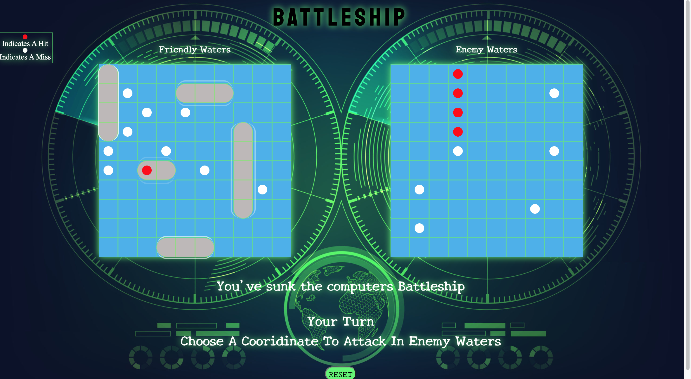

# Battleship
A take on the classic table top gameboard. This is my first project with General Assembly and my first true project as a programmer. 

## Project Link
### [Battleship](https://markrissmiller.github.io/project__1/)

## Contributors
* **Mark Rissmiller** https://github.com/markrissmiller

## Technologies Used
* JavaScript
* HTML5
* CSS

## Challenges/Future Goals/ Bugs
* Placing your horizontal ships, if any div is placed after "square" 99 the front divs land on the board with the rest of the ship lost off the board.
* To place a vertical ship accuratly you must grab the ship by the first DIV that makes up the ship. Else it will jump or not lay omn the board.
* Ships can be placed on top of each other.
* Would like gameGo() to have logic where if a computer turn results in a hit the next turn would be randomly selected from the surrounding eight squares only. 
* Would love to add remote multi-player game play. 

## Screenshots
  

## Special Thanks
* Thank you to the General Assembly SEIR-ERICA instructional team and classmates for support and mentorship. 